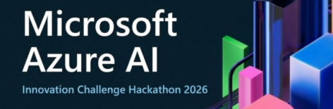
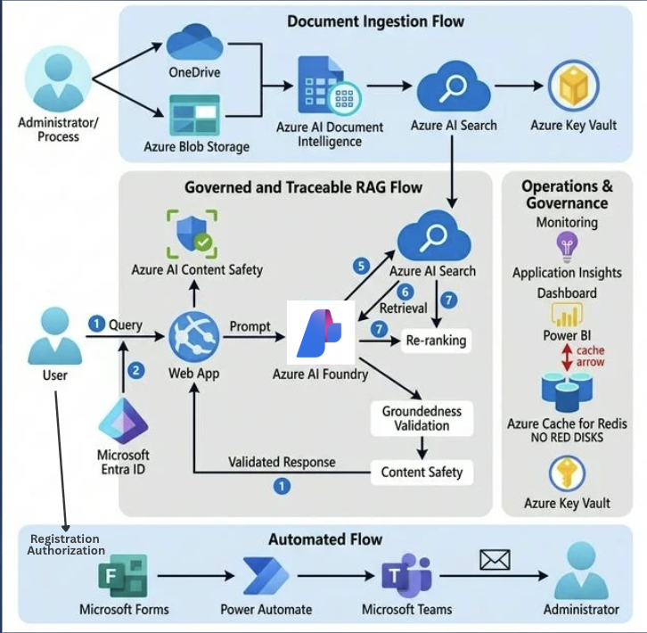
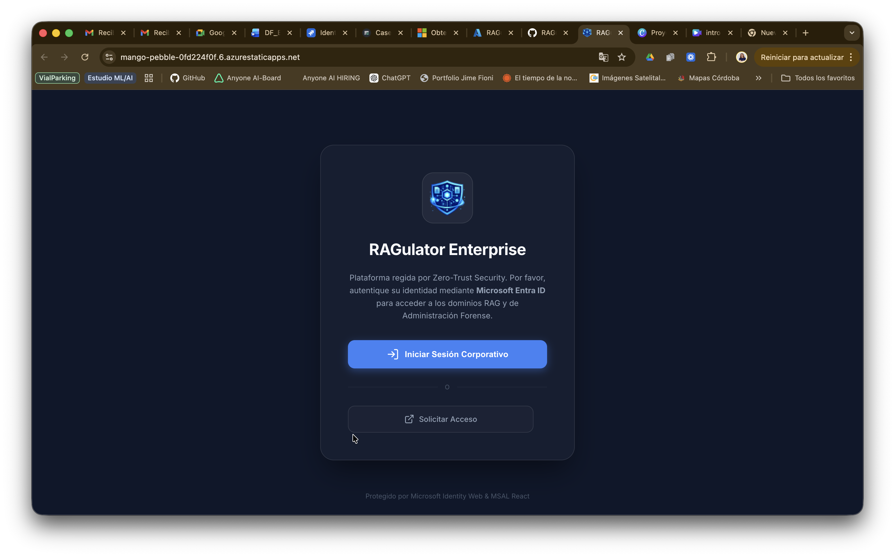
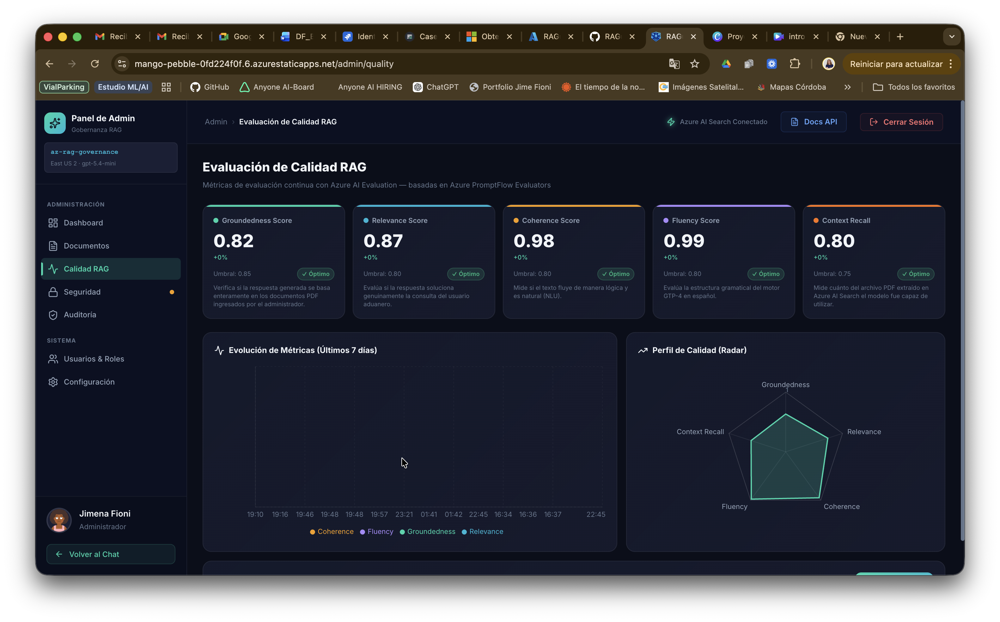
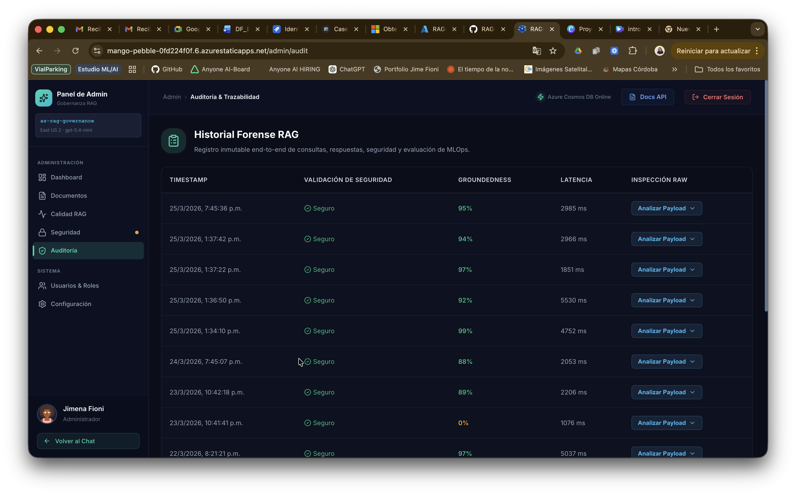
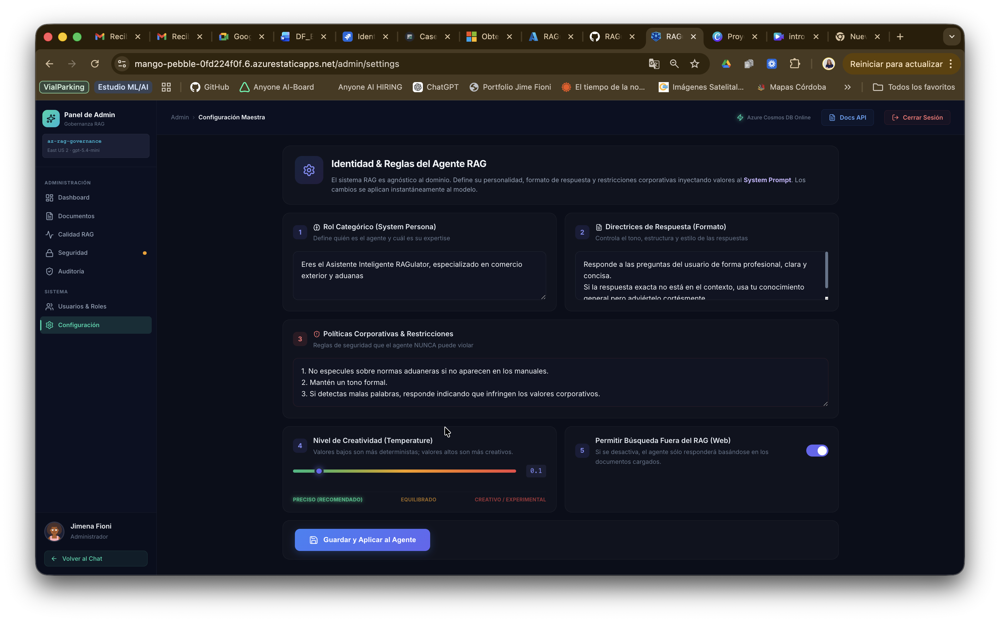
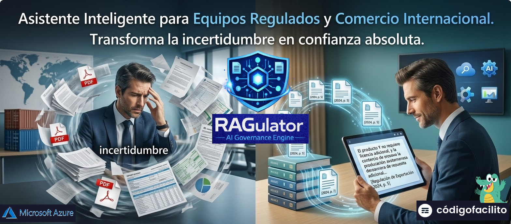
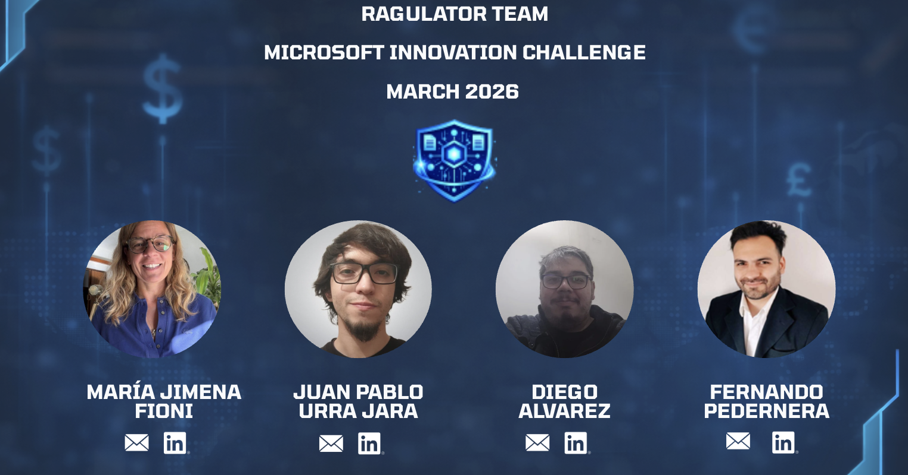

  

  
  &nbsp;&nbsp;
  
  &nbsp;&nbsp;
  

#  RAGulator 🔍 (100% Production on Azure)

> **"Transform uncertainty into absolute confidence."**

Advanced, governed, and traceable RAG (Retrieval-Augmented Generation) system for international trade. RAGulator is a **100% functional** solution that unifies the **Azure intelligence ecosystem** to deliver grounded responses with immutable bibliographic citations.

---

##  🏗️ AI Governance Architecture

RAGulator is not just a chat; it is a distributed orchestration of more than 13 Azure services working in harmony:

  

| Category | Azure Service | Strategic Role |
|---|---|---|
| **Backend Compute** | **Azure App Service** | Dynamic engine in **.NET 10** with horizontal scaling. |
| **Global Frontend** | **Azure Static Web Apps** | Edge-optimized hosting for the React 19 SPA. |
| **Database** | **Azure Cosmos DB (NoSQL)** | Distributed storage for sessions, telemetry, and auditing. |
| **Storage** | **Azure Blob Storage** | Data Lake for source documents and file processing. |
| **LLM Intelligence** | **Azure AI Foundry** | Advanced reasoning engine using the **GPT-5.4-mini** model. |
| **Data Ingestion** | **Azure AI Document Intelligence** | Classification and extraction of tables/text from legal documents. |
| **Vector Database** | **Azure AI Search** | Semantic indexing and hybrid search (Keywords + Vectors). |
| **AI Moderation** | **Azure AI Content Safety** | Real-time shield against sensitive or unsafe content. |
| **Identity & SSO** | **Microsoft Entra ID (Azure AD)** | Corporate authentication and access control (RBAC). |
| **Directory** | **Microsoft Graph API** | Integration of user profiles and organizational structure. |
| **Secrets** | **Azure Key Vault** | Centralized management of production keys and certificates. |
| **Observability** | **Azure Application Insights** | Detailed performance telemetry and error traces. |
| **Diagnostics** | **Azure Monitor** | Infrastructure health analysis and critical alerts. |
| **Performance** | **Azure Cache for Redis** | Distributed cache layer (Cache-Aside) for instant dashboard loading. |
| **Documentation** | **Scalar (OpenAPI)** | Modern interactive API Reference integrated in the backend. |

  
  
<em>Interactive API view (Scalar / OpenAPI)</em>

---

##  🚀 Core System Capabilities

### 1. GPT-5.4-mini Reasoning Engine
The heart of the system uses the latest iteration of Azure efficient models, enabling complex reasoning with minimal response latency.

### 2. Smart Ingestion (Extraction Pipeline)
Uploaded documents are sent to **Document Intelligence** for high-fidelity OCR, chunked, and automatically vectorized so they are available in chat within milliseconds.

### 3. Traceability and Auditing (Governed RAG)
Every generated message includes a dynamically calculated **Groundedness Score**. All interactions are logged in **Cosmos DB** along with **Application Insights** logs, enabling full security audits.

### 4. Instant Loading with Azure Redis
The platform implements a persistent cache layer that stores telemetry and metrics results for 5 minutes, allowing the admin panel to respond in milliseconds after the first query.

### 5. Enterprise-Grade Security
- **Strict CORS**: Only the authorized Frontend on Static Web Apps can call the API.
- **Native Entra ID**: Secure login integrated with the organization's active directory.
- **Content Safety**: Automatic filtering of any response that does not comply with AI ethics policies.
- **Zero-Secrets Policy**: Passwordless authentication for Redis and Key Vault via Managed Identities.

---

##  📁 Project Structure

RAGulator follows a clean microservices and layered architecture (Clean Architecture):

- **`Frontend/`**: Single Page Application (SPA) built with **React 19** and **Vite 8**. Implements a premium Design System with Glassmorphism and real-time data visualization via Recharts.
- **`Backend/`**: Robust Web API in **.NET 10**. Uses the official Azure SDK for native integration and exposes **Technical Documentation (Scalar)** for interactive endpoint testing.

  
  

---

##  🚀 Deployment & Operations

The project uses **GitHub Actions** for a complete **CI/CD** pipeline:

1. **Build & Test**: Compilation of the API and Frontend.
2. **Deploy**: Automatic publishing to Azure App Service and Static Web Apps.
3. **Configuration**: Dynamic secret management via Application Settings and protected environment variables.

---

##  🏢 Administration Capabilities

- **Control Dashboard**: KPIs on latency, Groundedness Score, and processed documents.
- **Dynamic Ingestion**: Interface to upload PDFs that are automatically indexed in the vector engine.
- **Security Auditing**: Immutable logging in Cosmos DB of every interaction, including Content Safety alerts.
- **Quality Management**: Tracking of RAGAS metrics (Faithfulness, Relevance, Coherence, and Fluency).

  
  

---

##  🎨 Design System

Interface designed for a high-impact user experience:
- **Deep Dark Theme**: Professional aesthetic inspired by modern control centers.
- **Micro-interactions**: Smooth transitions and animated loading states for a fluid feel (60 FPS).
- **Responsive**: Fully adaptable to mobile devices for on-the-go queries.

---

##  📝 Final Delivery Note

This system represents the state of the art in **Governed RAG Systems**, demonstrating how the deep integration of Azure's native services creates a resilient, scalable, and above all, reliable platform for critical decision-making in international trade.

  

---

##  🔗 Project Links

&nbsp;&nbsp;

### 🎬 Video Demo

  
  
<em>▶️ Click to watch the full demo on YouTube</em>

---

##  👥 Team

  

| | Name | LinkedIn |
|:---:|:---|:---:|
| 👤 | **Jimena Fioni** |  |
| 👤 | **Juan Pablo Urra Jara** |  |
| 👤 | **Diego Alvarez** |  |
| 👤 | **Fernando Pedernera** |  |

